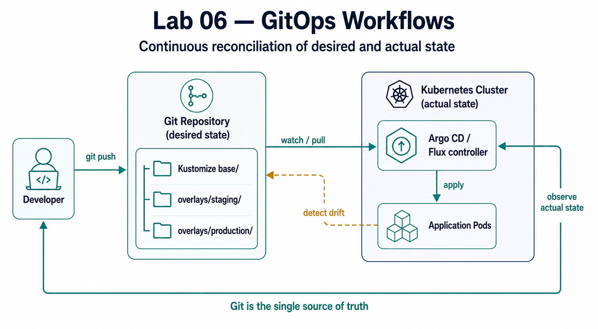

# Architecture diagrams

Generated showcase images for the labs. Create them from the prompts in
[`visual-specs/showcase-image-prompts.md`](../../visual-specs/showcase-image-prompts.md),
then drop the PNGs here using the filenames below and embed them in each lab's
`## Architecture` section (replacing the ASCII block):

```markdown

```

| File | Used in |
|------|---------|
| `00-curriculum-map.png` | `labs/README.md`, `index.md` |
| `01-vpc-foundation.png` | `labs/01-terraform-foundations/README.md` |
| `02-eks-platform.png` | `labs/02-kubernetes-platform/README.md` |
| `03-cicd-pipeline.png` | `labs/03-cicd-pipelines/README.md` |
| `04-observability-stack.png` | `labs/04-observability-stack/README.md` |
| `05-security-layers.png` | `labs/05-security-automation/README.md` |
| `06-gitops-reconciliation.png` | `labs/06-gitops-workflows/README.md` |
| `07-serverless-architecture.png` | `labs/07-serverless-operations/README.md` |
| `08-idp-platform.png` | `labs/08-platform-engineering/README.md` |
| `overview-platform.png` | "How the Eight Labs Connect" — embedded in `index.md`, root `README.md`, and `labs/README.md` |

Keep images flat-vector, white background, and on the shared palette so the set
stays visually consistent (see the prompt file's style block).
