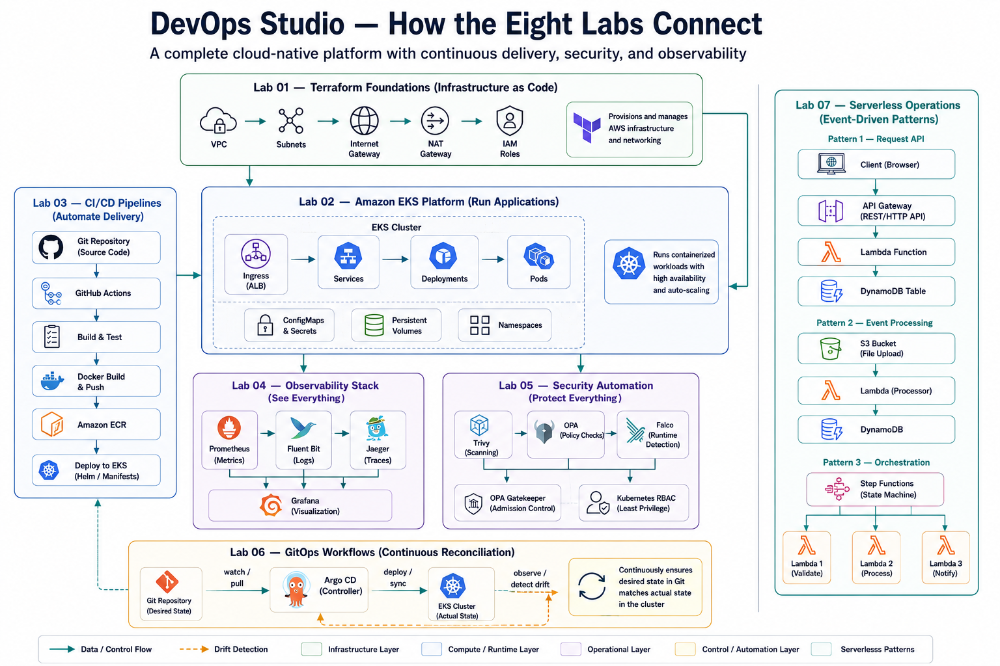

## How it all connects

The eight labs aren't isolated exercises — they compose into one cloud-native platform: a Terraform foundation beneath everything, EKS at the center, CI/CD and GitOps delivering into it, observability and security wrapped around it, serverless alongside, and a self-service platform layer on top.

## What makes this different

Every lab here is **deployable, tested, and built on real production patterns** — not a toy. Each one is self-contained, with setup, execution, validation, and cleanup, plus the cost considerations to run it on a learning budget.

- **Actually works** — full IaC and code, runnable in real AWS environments
- **Production patterns** — enterprise architectures, not simplified demos
- **Progressive** — from foundations to advanced platform engineering
- **Cost-conscious** — right-sized resources with cleanup automation
- **Portfolio-ready** — demonstrates skills employers hire for

New here? Read the [Prerequisites](/docs/prerequisites) and [Getting Started](/docs/getting-started) guides first, then pick a [Learning Path](/docs/learning-paths).
