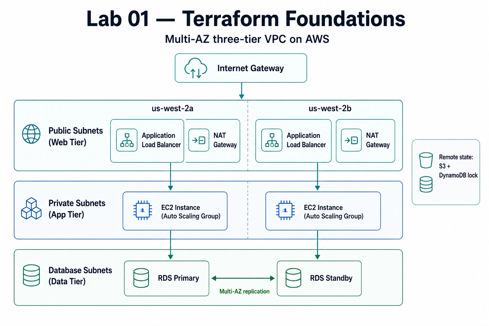

# Lab 01 · Terraform Foundations

> [DevOps Studio](../../README.md) › [Labs](../README.md) › Lab 01 · ⏱ 1–2 hours · **Beginner**

**Build a production-style AWS network and web tier with Terraform — the foundation every later lab builds on. By the end you'll have a multi-AZ VPC, an auto-scaling web tier behind a load balancer, and an encrypted database, all created from code you can destroy in one command.**

**On this page:** [Architecture](#architecture) · [Prerequisites](#prerequisites) · [Quick Start](#quick-start) · [Detailed Setup](#detailed-setup) · [Project Structure](#project-structure) · [Configuration](#configuration) · [Troubleshooting](#troubleshooting) · [Cleanup](#cleanup)

## What you build

- **Multi-AZ VPC** — public, private, and database subnets across two availability zones
- **Auto Scaling Group + Application Load Balancer** — a self-healing web tier
- **RDS MySQL (Multi-AZ)** — encrypted, with automated backups
- **CloudWatch** — dashboards and alerts
- **IAM roles & security groups** — least-privilege access
- **Remote state** — an S3 bucket with DynamoDB locking

**Skills you'll practice:** Terraform modules and remote state · VPC and subnet design · auto scaling and load balancing · RDS Multi-AZ · IAM least privilege · CloudWatch monitoring.

## Architecture




### Component Details

| Component | Purpose | High Availability | Security |
|-----------|---------|-------------------|----------|
| **VPC** | Network isolation | Multi-AZ design | Flow logs enabled |
| **Public Subnets** | Load balancer placement | 2+ AZs | Internet gateway access |
| **Private Subnets** | Application instances | 2+ AZs | NAT gateway egress only |
| **Database Subnets** | RDS instances | Multi-AZ with failover | No internet access |
| **Auto Scaling Group** | Application scaling | Cross-AZ distribution | Security groups |
| **RDS MySQL** | Data persistence | Multi-AZ with backups | Encryption + secrets |

---

## Prerequisites

### Required Tools

| Tool | Version | Purpose |
|------|---------|---------|
| **AWS CLI** | 2.0+ | AWS resource management |
| **Terraform** | 1.9+ | Infrastructure provisioning |
| **Git** | 2.0+ | Version control |
| **curl** | Any | Testing and validation |
| **jq** | 1.6+ | JSON processing (optional) |

### AWS Requirements

- **AWS Account** with billing enabled
- **IAM User** with programmatic access
- **Required Permissions**:
  - EC2 Full Access
  - VPC Full Access
  - RDS Full Access
  - IAM permissions for roles and policies
  - CloudWatch Full Access
  - S3 Full Access (for Terraform state)
  - DynamoDB Full Access (for state locking)

### System Requirements

- **Operating System**: macOS, Linux, or WSL2
- **Memory**: 4GB+ available
- **Disk Space**: 2GB+ free
- **Network**: Reliable internet connection

### Knowledge Prerequisites

- Basic AWS concepts (VPC, EC2, RDS)
- Terraform fundamentals (resources, modules, state)
- Command line comfort
- Basic networking concepts

---

## Quick Start

For experienced users who want to deploy immediately:

```bash
# 1. Clone and navigate
git clone <repository-url>
cd devops-studio/labs/01-terraform-foundations

# 2. Set up backend
./scripts/setup-backend.sh

# 3. Configure
cp terraform.tfvars.example terraform.tfvars
# Edit terraform.tfvars with your preferences

# 4. Deploy
make apply

# 5. Test
make test

# 6. View outputs
make output
```

**Deployment time**: ~15 minutes  
**Estimated cost**: $20-40/month

---

## Detailed Setup

### Step 1: Environment Preparation

#### Configure AWS CLI
```bash
# Configure AWS credentials
aws configure

# Verify access
aws sts get-caller-identity
```

#### Verify Tool Versions
```bash
# Check Terraform version
terraform version

# Check AWS CLI version
aws --version
```

### Step 2: Repository Setup

```bash
# Clone the repository
git clone <repository-url>
cd devops-studio/labs/01-terraform-foundations

# Verify file structure
ls -la
```

### Step 3: Backend Configuration

The backend setup script creates S3 bucket and DynamoDB table for remote state:

```bash
# Run the setup script
./scripts/setup-backend.sh

# What this creates:
# - S3 bucket: devops-studio-terraform-state-<timestamp>
# - DynamoDB table: devops-studio-terraform-locks
# - backend.tf with proper configuration
```

### Step 4: Configuration Customization

```bash
# Copy example configuration
cp terraform.tfvars.example terraform.tfvars

# Edit with your preferences
nano terraform.tfvars
```

#### Key Configuration Options

```hcl
# Basic settings
project_name = "devops-studio"     # Change if desired
environment = "dev"                # dev, staging, or prod
region = "us-west-2"              # Your preferred region

# Networking
vpc_cidr = "10.0.0.0/16"          # Adjust if conflicts exist
availability_zones = ["us-west-2a", "us-west-2b"]

# Application sizing
instance_type = "t3.micro"         # t3.micro for testing
min_size = 1                       # Minimum instances
max_size = 3                       # Maximum instances
desired_capacity = 2               # Starting instances

# Database configuration
db_instance_class = "db.t3.micro"  # Database size
db_allocated_storage = 20          # Storage in GB

# Cost control
enable_deletion_protection = false # Set true for production
```

---

## Project Structure

```
labs/01-terraform-foundations/
├── README.md                    # This file
├── Makefile                     # Automation commands
├── main.tf                      # Main infrastructure
├── variables.tf                 # Input variables
├── outputs.tf                   # Output values
├── backend.tf                   # Generated by setup script
├── terraform.tfvars.example     # Example configuration
├── terraform.tfvars             # Your configuration (gitignored)
├── modules/
│   ├── vpc/                     # VPC module
│   │   ├── main.tf             # VPC resources
│   │   ├── variables.tf        # VPC variables
│   │   └── outputs.tf          # VPC outputs
│   ├── web-app/                # Web application module
│   │   ├── main.tf             # App resources
│   │   ├── variables.tf        # App variables
│   │   ├── outputs.tf          # App outputs
│   │   └── user-data.sh        # Instance initialization
│   └── database/               # Database module
│       ├── main.tf             # RDS resources
│       ├── variables.tf        # DB variables
│       └── outputs.tf          # DB outputs
├── environments/               # Environment-specific configs
│   ├── dev.tfvars             # Development settings
│   ├── staging.tfvars         # Staging settings
│   └── prod.tfvars            # Production settings
└── scripts/                   # Automation scripts
    ├── setup-backend.sh       # Backend initialization
    ├── validate.sh            # Infrastructure testing
    └── cleanup.sh             # Resource cleanup
```

### Module Design Philosophy

Each module is designed for:
- **Single Responsibility**: VPC handles networking, web-app handles compute
- **Reusability**: Modules work across dev/staging/prod environments
- **Composability**: Modules integrate cleanly with outputs/inputs
- **Testability**: Each module can be validated independently

---

## Configuration

### Environment Variables

The lab supports environment-specific configurations:

```bash
# Deploy to different environments
make apply ENV=dev        # Uses environments/dev.tfvars
make apply ENV=staging    # Uses environments/staging.tfvars
make apply ENV=prod       # Uses environments/prod.tfvars
```

### Variable Validation

All variables include validation rules:

```hcl
variable "vpc_cidr" {
  description = "CIDR block for the VPC"
  type        = string
  default     = "10.0.0.0/16"
  
  validation {
    condition     = can(cidrhost(var.vpc_cidr, 0))
    error_message = "VPC CIDR must be a valid IPv4 CIDR block."
  }
}
```

### Tagging Strategy

Consistent tagging across all resources:

```hcl
tags = {
  Project     = "DevOps Studio"
  Environment = "Development"
  ManagedBy   = "Terraform"
  Owner       = "Your Name"
  CostCenter  = "Engineering"
}
```

---

## Deployment

### Using Make Commands (Recommended)

```bash
# Initialize Terraform
make init

# Create execution plan
make plan

# Apply changes
make apply

# View outputs
make output

# Run validation tests
make test

# Check application logs
make logs

# Connect to instances (requires SSM)
make ssh
```

### Direct Terraform Commands

```bash
# Initialize
terraform init

# Plan with specific environment
terraform plan -var-file="environments/dev.tfvars"

# Apply with auto-approval
terraform apply -var-file="environments/dev.tfvars" -auto-approve

# Show outputs
terraform output
```

### Deployment Phases

The deployment creates resources in this order:

1. **Networking** (2-3 minutes)
   - VPC, subnets, gateways
   - Route tables and associations

2. **Security** (1-2 minutes)
   - Security groups
   - IAM roles and policies

3. **Compute** (3-5 minutes)
   - Launch template
   - Auto Scaling Group
   - Application Load Balancer

4. **Database** (8-12 minutes)
   - RDS subnet group
   - RDS instance creation

5. **Monitoring** (1-2 minutes)
   - CloudWatch resources
   - Log groups

**Total deployment time**: 15-25 minutes

---

## Testing & Validation

### Automated Validation

The lab includes comprehensive testing:

```bash
# Run all validation tests
make test

# Individual test components:
./scripts/validate.sh
```

### Test Coverage

| Test | Description | Success Criteria |
|------|-------------|------------------|
| **Load Balancer Health** | ALB endpoint responds | HTTP 200 response |
| **Application Response** | App returns expected content | Contains "DevOps Studio" |
| **Auto Scaling** | ASG has healthy instances | ≥1 InService instance |
| **Database Connectivity** | RDS is accessible | DB status = "available" |
| **Security Groups** | Proper rule configuration | Rules match expectations |
| **Performance** | Response time testing | <2 second response time |

### Manual Testing

```bash
# Get application URL
ALB_DNS=$(terraform output -raw load_balancer_dns)

# Test main application
curl http://$ALB_DNS/

# Test health endpoint
curl http://$ALB_DNS/health

# Test metrics endpoint
curl http://$ALB_DNS/metrics

# Load testing
curl "http://$ALB_DNS/load?iterations=100000"
```

### Expected Responses

**Health Check Response**:
```json
{
  "status": "healthy",
  "timestamp": "2024-01-15T10:30:00Z",
  "instance": "i-1234567890abcdef0",
  "uptime": 300.5
}
```

**Main Application**: Interactive web interface showing:
- Infrastructure details
- Instance information
- Monitoring links
- Feature demonstrations

---

## Monitoring

### CloudWatch Integration

The infrastructure includes comprehensive monitoring:

#### Metrics Collected
- **EC2**: CPU utilization, network I/O, disk usage
- **ALB**: Request count, response time, error rates
- **RDS**: CPU, memory, disk I/O, connections
- **Auto Scaling**: Instance counts, scaling activities

#### Log Groups
- `/aws/ec2/${project-name}-${environment}`: Application logs
- `/aws/rds/instance/${project-name}-${environment}-db/*`: Database logs
- `/aws/vpc/flowlogs/${project-name}-${environment}`: VPC flow logs

#### Dashboards

Access the CloudWatch dashboard:
```bash
# Get dashboard URL
terraform output dashboard_url
```

Dashboard includes:
- Application Load Balancer metrics
- Auto Scaling Group status
- Database performance metrics
- Cost and utilization tracking

#### Alarms and Scaling

Automatic scaling triggers:
- **Scale Up**: CPU > 70% for 2 consecutive periods
- **Scale Down**: CPU < 30% for 2 consecutive periods
- **Cooldown**: 5 minutes between scaling actions

---

## Troubleshooting

### Common Issues

#### Backend Setup Fails
```bash
# Error: InvalidUserID.NotFound
# Solution: Check AWS CLI configuration
aws sts get-caller-identity

# Error: BucketAlreadyExists
# Solution: S3 bucket names are globally unique
# Edit PROJECT_NAME in setup-backend.sh
```

#### Terraform Plan Shows Constant Changes
```bash
# Error: Resources show changes on every run
# Solution: Run refresh to sync state
terraform refresh

# Check for configuration drift
terraform plan -detailed-exitcode
```

#### Application Returns 502 Errors
```bash
# Error: ALB returns Bad Gateway
# Solution: Check instance health
aws autoscaling describe-auto-scaling-groups \
  --auto-scaling-group-names "devops-studio-dev-asg"

# Check application logs
make logs
```

#### Database Connection Issues
```bash
# Error: Cannot connect to RDS
# Solution: Verify security groups
aws ec2 describe-security-groups \
  --filters "Name=group-name,Values=*database*"

# Check RDS status
aws rds describe-db-instances \
  --db-instance-identifier "devops-studio-dev-db"
```

#### High AWS Costs
```bash
# Check running resources
aws ec2 describe-instances --query 'Reservations[*].Instances[?State.Name==`running`]'

# Review RDS instances
aws rds describe-db-instances --query 'DBInstances[?DBInstanceStatus==`available`]'

# Emergency cleanup
make destroy
```

### Getting Help

1. **Check the logs**: `make logs`
2. **Validate configuration**: `terraform validate`
3. **Review AWS CloudFormation events**: Check the AWS Console
4. **Enable Terraform debugging**: `export TF_LOG=DEBUG`
5. **Check AWS service status**: [AWS Health Dashboard](https://health.aws.amazon.com/health/status)

### Debug Mode

Enable detailed logging:
```bash
# Set Terraform debug level
export TF_LOG=DEBUG
export TF_LOG_PATH=./terraform.log

# Run commands with verbose output
terraform plan -var-file="terraform.tfvars"
```

---

## Cleanup

### Quick Cleanup

```bash
# Destroy all infrastructure
make destroy

# Confirm destruction
# Type 'y' when prompted
```

### Complete Cleanup (Including Backend)

```bash
# Destroy infrastructure and backend resources
./scripts/cleanup.sh

# WARNING: This deletes everything including:
# - All EC2 instances and load balancers
# - VPC and networking components
# - RDS database (with data loss)
# - S3 bucket with Terraform state
# - DynamoDB table for state locking
```

### Selective Cleanup

```bash
# Destroy specific resources
terraform destroy -target=module.database
terraform destroy -target=module.web_app
terraform destroy -target=module.vpc
```

### Cost Optimization

Before long-term deployment:

```bash
# Scale down for cost savings
terraform apply -var="desired_capacity=0" -var="min_size=0"

# Use spot instances (modify in terraform.tfvars)
# instance_type = "t3.micro"  # On-demand
# spot_price = "0.01"         # Spot instance pricing
```

---

## Cost Considerations

### Estimated Monthly Costs (us-west-2)

| Resource | Configuration | Estimated Cost |
|----------|---------------|----------------|
| **EC2 Instances** | 2x t3.micro | $16.00 |
| **Application Load Balancer** | Standard ALB | $22.00 |
| **RDS MySQL** | db.t3.micro, Multi-AZ | $25.00 |
| **NAT Gateways** | 2x Standard | $45.00 |
| **Data Transfer** | Typical usage | $5.00 |
| **CloudWatch** | Logs and metrics | $3.00 |
| **S3 Storage** | Terraform state | $1.00 |
| **Total** | | **~$117/month** |

### Cost Optimization Tips

#### Development Environment
```hcl
# In dev.tfvars
instance_type = "t3.micro"
desired_capacity = 1
min_size = 1
max_size = 2
db_instance_class = "db.t3.micro"
```

#### Testing/Learning
```bash
# Scale to zero when not in use
terraform apply -var="desired_capacity=0" -var="min_size=0"

# Use single NAT gateway
# Set single_nat_gateway = true in VPC module
```

#### Production Considerations
- Use Reserved Instances for predictable workloads
- Consider Savings Plans for flexible compute usage
- Implement automated cost monitoring and alerts
- Regular right-sizing analysis

### AWS Free Tier Eligibility
- EC2: 750 hours/month of t2.micro or t3.micro
- RDS: 750 hours/month of db.t2.micro or db.t3.micro
- Load Balancer: Not included in free tier
- NAT Gateway: Not included in free tier

---

## Next Steps

### Immediate Next Actions
1. **Deploy the lab** and verify all components work
2. **Experiment with scaling** by changing desired_capacity
3. **Review CloudWatch metrics** and understand the data
4. **Test disaster scenarios** by terminating instances
5. **Explore the web application** features and endpoints

### Extending This Lab
- **Add HTTPS support** with ACM certificates
- **Implement blue-green deployments** with multiple target groups
- **Add container support** with ECS or EKS integration
- **Enhanced monitoring** with custom CloudWatch metrics
- **Cost optimization** with Spot Instances and Reserved Capacity

### Continue Your Learning Journey

#### Next Recommended Lab
- **[Lab 02 - Kubernetes Platform](../02-kubernetes-platform/README.md)** - Deploy EKS cluster on this VPC foundation

#### Related Labs in This Series
- **[Lab 03: CI/CD Pipelines](../03-cicd-pipelines/README.md)** - Automate deployments to this infrastructure
- **[Lab 04: Observability Stack](../04-observability-stack/README.md)** - Advanced monitoring with Prometheus/Grafana
- **[Lab 05: Security Automation](../05-security-automation/README.md)** - Implement DevSecOps practices
- **[Lab 06: GitOps Workflows](../06-gitops-workflows/README.md)** - Deploy applications with ArgoCD
- **[Lab 07: Serverless Operations](../07-serverless-operations/README.md)** - Event-driven architectures
- **[Lab 08: Platform Engineering](../08-platform-engineering/README.md)** - Build internal developer platforms

#### Learning Paths
Choose your path based on your career goals - see the [complete DevOps Studio guide](../../docs/learning-paths.md):

- **🏗️ [Platform Engineering Track](../../docs/learning-paths.md)**: Labs 01 → 02 → 06 → 08
- **🔒 [DevSecOps Track](../../docs/learning-paths.md)**: Labs 01 → 03 → 05 → 04  
- **☁️ [Cloud Architecture Track](../../docs/learning-paths.md)**: Labs 01 → 07 → 02 → 04

---

## Additional Resources

### Documentation
- [Terraform AWS Provider](https://registry.terraform.io/providers/hashicorp/aws/latest/docs)
- [AWS VPC User Guide](https://docs.aws.amazon.com/vpc/latest/userguide/)
- [AWS Auto Scaling User Guide](https://docs.aws.amazon.com/autoscaling/ec2/userguide/)
- [AWS RDS User Guide](https://docs.aws.amazon.com/rds/latest/userguide/)

### Learning Resources
- [AWS Well-Architected Framework](https://aws.amazon.com/architecture/well-architected/)
- [Terraform Best Practices](https://www.terraform.io/docs/cloud/guides/recommended-practices/)
- [AWS Security Best Practices](https://aws.amazon.com/architecture/security-identity-compliance/)

### Tools and Extensions
- [AWS CLI](https://aws.amazon.com/cli/) - Command line interface
- [Terraform](https://terraform.io/) - Infrastructure as Code
- [terragrunt](https://terragrunt.gruntwork.io/) - Terraform wrapper for DRY configs
- [infracost](https://www.infracost.io/) - Cost estimation for Terraform
- [tfsec](https://github.com/aquasecurity/tfsec) - Security scanning for Terraform

### Community
- [AWS Community](https://aws.amazon.com/developer/community/)
- [Terraform Community](https://discuss.hashicorp.com/c/terraform-core/)
- [DevOps Community](https://www.reddit.com/r/devops/)

---

**🎉 Congratulations!** You've completed Lab 01 and built production-ready infrastructure with Terraform. This foundation supports all advanced scenarios in the DevOps Studio learning platform.

**Ready for the next challenge?** Continue to [Lab 02 - Kubernetes Platform](../02-kubernetes-platform/) to deploy a managed Kubernetes cluster on this infrastructure.

---

**Navigation:** [All labs](../README.md) · [Lab 02 · Kubernetes Platform ▶](../02-kubernetes-platform/README.md)
