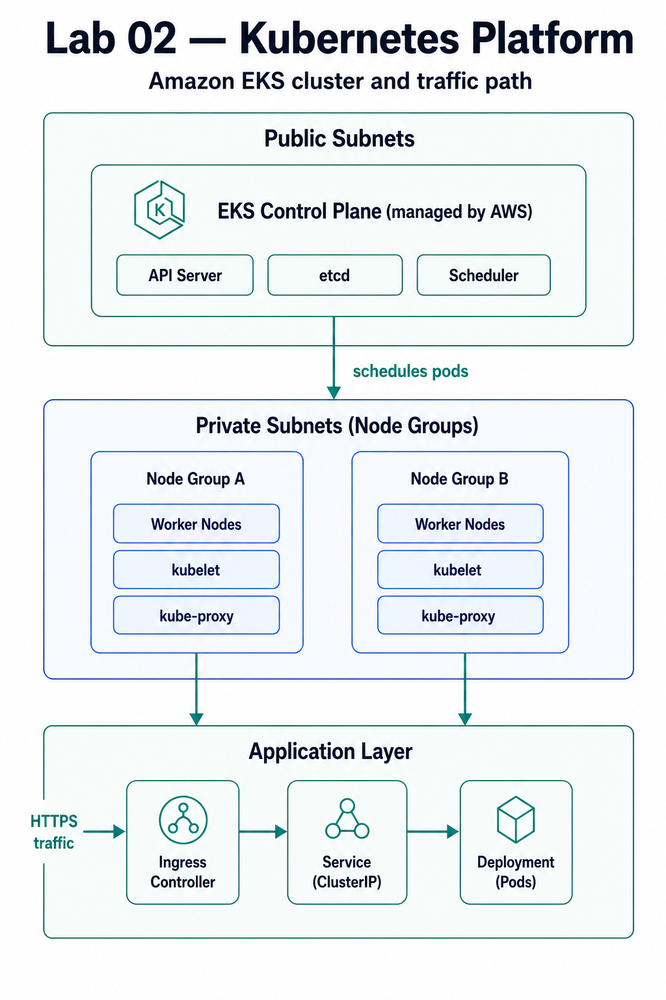

# Lab 02 - Kubernetes Platform
*Deploying Production-Ready EKS Cluster with Helm and Ingress*

> **Navigation**: [DevOps Studio](../../README.md) > [Labs](../README.md) > Lab 02  
> **Previous Lab**: [Lab 01 - Terraform Foundations](../01-terraform-foundations/README.md)  
> **Next Lab**: [Lab 03 - CI/CD Pipelines](../03-cicd-pipelines/README.md)

[](https://kubernetes.io)
[](https://terraform.io)
[](https://aws.amazon.com/eks)
[](https://helm.sh)

> **Objective**: Deploy a production-ready Amazon EKS (Elastic Kubernetes Service) cluster with managed node groups, configure Helm for package management, set up Ingress for external access, and deploy sample applications. This lab builds on Lab 01's VPC foundation and introduces container orchestration concepts.

---

## 📑 Table of Contents

- [Overview](#overview)
- [What You'll Learn](#what-youll-learn)
- [Architecture](#architecture)
- [Prerequisites](#prerequisites)
- [Quick Start](#quick-start)
- [Detailed Setup](#detailed-setup)
- [Project Structure](#project-structure)
- [Configuration](#configuration)
- [Deployment](#deployment)
- [Testing & Validation](#testing--validation)
- [Monitoring](#monitoring)
- [Troubleshooting](#troubleshooting)
- [Cleanup](#cleanup)
- [Learning Objectives](#learning-objectives)
- [Best Practices Demonstrated](#best-practices-demonstrated)
- [Cost Considerations](#cost-considerations)
- [Next Steps](#next-steps)
- [Additional Resources](#additional-resources)

---

## Overview

This lab deploys a complete, production-ready EKS cluster that demonstrates enterprise-level Kubernetes and AWS patterns. You'll learn how to manage containerized applications at scale, configure networking, and use Helm for package management.

### What Gets Built

- **Amazon EKS Cluster** with managed control plane
- **Managed Node Groups** with auto-scaling capabilities
- **VPC CNI** for pod networking
- **CoreDNS** for service discovery
- **kube-proxy** for service networking
- **Helm Charts** for common tools (NGINX Ingress, Metrics Server)
- **Sample Applications** demonstrating deployments and services
- **IAM Roles** for service accounts (IRSA)
- **Security Groups** for cluster and node communication

### Key Features

- ✅ **Production Patterns**: Real enterprise-grade EKS configurations
- ✅ **Multi-Environment**: Dev, staging, and production ready
- ✅ **Security First**: IRSA, network policies, encryption
- ✅ **Automated Setup**: Scripts for cluster configuration
- ✅ **Cost Optimized**: Right-sized node groups with auto-scaling
- ✅ **Well Documented**: Clear explanations and troubleshooting guides

---

## What You'll Learn

### Kubernetes Fundamentals
- Cluster architecture and components
- Pods, Deployments, Services, and Ingress
- Namespaces and resource management
- ConfigMaps and Secrets

### Amazon EKS
- EKS cluster creation and management
- Managed node groups configuration
- VPC CNI for pod networking
- EKS add-ons (CoreDNS, kube-proxy, VPC CNI)
- IAM Roles for Service Accounts (IRSA)

### Helm Package Management
- Helm chart installation and management
- Custom Helm chart creation
- Chart repositories and dependencies
- Helm values customization

### Networking & Ingress
- Kubernetes Service types (ClusterIP, NodePort, LoadBalancer)
- Ingress controller configuration
- External access patterns
- Network policies

### Container Orchestration
- Deployment strategies (rolling updates, blue-green)
- Health checks and probes
- Resource limits and requests
- Horizontal Pod Autoscaling

### Security & Compliance
- IAM Roles for Service Accounts
- Security group configuration
- Network isolation
- RBAC basics

---

## Architecture




### Component Details

| Component | Purpose | High Availability | Security |
|-----------|---------|-------------------|----------|
| **EKS Cluster** | Kubernetes control plane | Multi-AZ (managed) | IAM authentication |
| **Node Groups** | Worker nodes for pods | Multi-AZ, auto-scaling | Security groups, IRSA |
| **VPC CNI** | Pod networking | Multi-AZ | Network isolation |
| **CoreDNS** | Service discovery | Replicated | Namespace isolation |
| **Ingress Controller** | External access | Replicated | TLS termination |

---

## Prerequisites

### Required Tools

| Tool | Version | Purpose |
|------|---------|---------|
| **AWS CLI** | 2.0+ | AWS resource management |
| **Terraform** | 1.5+ | Infrastructure provisioning |
| **kubectl** | 1.28+ | Kubernetes cluster management |
| **Helm** | 3.10+ | Kubernetes package management |
| **Git** | 2.0+ | Version control |

### AWS Requirements

- **AWS Account** with billing enabled
- **IAM User** with programmatic access
- **Required Permissions**:
  - EKS Full Access
  - EC2 Full Access (for node groups)
  - VPC Full Access
  - IAM permissions for roles and policies
  - CloudWatch Full Access

### Knowledge Prerequisites

- Basic Kubernetes concepts (pods, services, deployments)
- Understanding of Lab 01 (VPC, networking)
- Command line comfort
- Basic container concepts

### Lab 01 Dependency

**Important**: Lab 02 can work standalone, but for best results, complete [Lab 01](../01-terraform-foundations/) first. Lab 02 can optionally use Lab 01's VPC infrastructure.

---

## Quick Start

For experienced users who want to deploy immediately:

```bash
# 1. Navigate to lab directory
cd labs/02-kubernetes-platform

# 2. Set up backend (if not already done)
./scripts/setup-backend.sh

# 3. Configure
cp terraform.tfvars.example terraform.tfvars
# Edit terraform.tfvars with your preferences

# 4. Deploy EKS cluster
make apply

# 5. Configure kubectl
make configure-kubectl

# 6. Deploy sample application
make deploy-app

# 7. Test
make test
```

**Deployment time**: ~20-25 minutes  
**Estimated cost**: $5-10 to complete (vs $120-180/month if kept running)

---

## Detailed Setup

### Step 1: Verify Prerequisites

```bash
# Check AWS CLI
aws --version
aws sts get-caller-identity

# Check Terraform
terraform version

# Check kubectl
kubectl version --client

# Check Helm
helm version
```

### Step 2: Repository Setup

```bash
# Navigate to lab directory
cd labs/02-kubernetes-platform

# Verify file structure
ls -la
```

### Step 3: Backend Configuration

```bash
# Set up Terraform backend (S3 + DynamoDB)
./scripts/setup-backend.sh
```

### Step 4: Configuration Customization

```bash
# Copy example configuration
cp terraform.tfvars.example terraform.tfvars

# Edit with your preferences
nano terraform.tfvars
```

#### Key Configuration Options

```hcl
# Basic settings
project_name = "devops-studio"
environment = "dev"
region = "us-west-2"

# EKS Configuration
cluster_version = "1.28"
cluster_name = "devops-studio-eks"

# Node Group Configuration
node_instance_type = "t3.medium"
node_min_size = 1
node_max_size = 3
node_desired_size = 2

# Networking (can use Lab 01 VPC or create new)
# vpc_id = ""  # Leave empty to create new VPC
# Or use existing VPC from Lab 01
```

---

## Project Structure

```
labs/02-kubernetes-platform/
├── README.md                    # This file
├── Makefile                     # Automation commands
├── main.tf                      # Main EKS infrastructure
├── variables.tf                 # Input variables
├── outputs.tf                   # Output values
├── backend.tf.example           # Backend configuration template
├── terraform.tfvars.example     # Example configuration
├── modules/
│   └── eks/                     # EKS cluster module
│       ├── main.tf             # EKS resources
│       ├── variables.tf        # Module variables
│       └── outputs.tf          # Module outputs
├── environments/               # Environment-specific configs
│   ├── dev.tfvars             # Development settings
│   ├── staging.tfvars         # Staging settings
│   └── prod.tfvars            # Production settings
├── manifests/                  # Kubernetes manifests
│   ├── namespace.yaml         # Namespace definitions
│   ├── deployment.yaml        # Sample deployments
│   ├── service.yaml           # Service definitions
│   └── ingress.yaml           # Ingress configurations
├── helm-charts/                # Helm charts
│   ├── nginx-ingress/         # NGINX Ingress chart
│   └── sample-app/            # Sample application chart
└── scripts/                   # Automation scripts
    ├── setup-backend.sh       # Backend initialization
    ├── configure-kubectl.sh   # kubectl configuration
    ├── validate.sh            # Cluster validation
    └── cleanup.sh             # Resource cleanup
```

---

## Configuration

### Environment Variables

The lab supports environment-specific configurations:

```bash
# Deploy to different environments
make apply ENV=dev        # Uses environments/dev.tfvars
make apply ENV=staging    # Uses environments/staging.tfvars
make apply ENV=prod       # Uses environments/prod.tfvars
```

### Variable Validation

All variables include validation rules:

```hcl
variable "cluster_version" {
  description = "Kubernetes version for EKS cluster"
  type        = string
  default     = "1.28"
  
  validation {
    condition     = can(regex("^1\\.(2[0-9]|3[0-9])$", var.cluster_version))
    error_message = "Cluster version must be a valid Kubernetes version (1.20-1.39)."
  }
}
```

---

## Deployment

### Using Make Commands (Recommended)

```bash
# Initialize Terraform
make init

# Create execution plan
make plan

# Apply changes (deploys EKS cluster)
make apply

# Configure kubectl to use the cluster
make configure-kubectl

# Verify cluster access
make verify-cluster

# Deploy sample application
make deploy-app

# View cluster information
make cluster-info
```

### Direct Terraform Commands

```bash
# Initialize
terraform init

# Plan with specific environment
terraform plan -var-file="environments/dev.tfvars"

# Apply
terraform apply -var-file="environments/dev.tfvars"

# Show outputs
terraform output
```

### Deployment Phases

The deployment creates resources in this order:

1. **Networking** (2-3 minutes)
   - VPC (if not using existing)
   - Subnets for EKS
   - Security groups

2. **IAM Roles** (1-2 minutes)
   - EKS cluster role
   - Node group role
   - Service account roles

3. **EKS Cluster** (10-15 minutes)
   - Control plane creation
   - Add-ons installation
   - Cluster endpoint configuration

4. **Node Groups** (5-8 minutes)
   - Launch template creation
   - Node group provisioning
   - Node registration

5. **Helm Charts** (2-3 minutes)
   - NGINX Ingress installation
   - Metrics Server installation
   - Chart validation (lint + template rendering)

**Total deployment time**: 20-25 minutes

---

## Testing & Validation

### Automated Validation

```bash
# Run all validation tests
make test

# Individual test components:
./scripts/validate.sh
```

### Helm Chart Validation

Before deploying Helm charts, validate them:

```bash
# Lint Helm charts (checks for errors and best practices)
make lint-helm

# Validate template rendering (ensures templates are valid)
make validate-helm

# Both validations run automatically before deployment
make deploy-helm-chart
```

**Validation checks**:
- Chart structure and metadata
- Template syntax correctness
- Values file validation
- Kubernetes manifest rendering

### Test Coverage

| Test | Description | Success Criteria |
|------|-------------|------------------|
| **Cluster Access** | kubectl can connect | `kubectl get nodes` succeeds |
| **Node Health** | All nodes are ready | All nodes show `Ready` status |
| **CoreDNS** | DNS resolution works | CoreDNS pods running |
| **Ingress** | Ingress controller ready | Ingress controller pods running |
| **Sample App** | Application deploys | Deployment shows available replicas |
| **Helm Charts** | Charts are valid | `helm lint` passes, templates render |

### Manual Testing

```bash
# Get cluster endpoint
CLUSTER_NAME=$(terraform output -raw cluster_name)
REGION=$(terraform output -raw region)

# Configure kubectl
aws eks update-kubeconfig --name $CLUSTER_NAME --region $REGION

# Check cluster status
kubectl cluster-info

# List nodes
kubectl get nodes

# List all pods
kubectl get pods --all-namespaces

# Check services
kubectl get services --all-namespaces

# Test sample application
kubectl get ingress -n default
```

---

## Monitoring

### CloudWatch Integration

The EKS cluster includes comprehensive monitoring:

#### Metrics Collected
- **EKS**: Cluster health, API server metrics
- **Node Groups**: CPU, memory, disk usage
- **Pods**: Resource utilization
- **Services**: Request rates, latency

#### Log Groups
- `/aws/eks/${cluster-name}/cluster`: Control plane logs
- `/aws/containerinsights/${cluster-name}/performance`: Container insights

### Accessing Metrics

```bash
# View cluster metrics in CloudWatch
aws cloudwatch list-metrics --namespace "ContainerInsights"

# View node group metrics
aws cloudwatch get-metric-statistics \
  --namespace AWS/EKS \
  --metric-name CPUUtilization \
  --dimensions Name=ClusterName,Value=$(terraform output -raw cluster_name)
```

---

## Troubleshooting

### Common Issues

#### kubectl Connection Fails
```bash
# Error: Unable to connect to the server
# Solution: Update kubeconfig
make configure-kubectl

# Or manually:
aws eks update-kubeconfig --name <cluster-name> --region <region>
```

#### Nodes Not Joining Cluster
```bash
# Check node group status
aws eks describe-nodegroup \
  --cluster-name <cluster-name> \
  --nodegroup-name <nodegroup-name>

# Check node group IAM role
# Ensure node group role has required policies
```

#### Pods Stuck in Pending
```bash
# Check pod events
kubectl describe pod <pod-name>

# Check node resources
kubectl top nodes

# Check for taints
kubectl get nodes -o custom-columns=NAME:.metadata.name,TAINTS:.spec.taints
```

#### Ingress Not Working
```bash
# Check ingress controller
kubectl get pods -n ingress-nginx

# Check ingress status
kubectl describe ingress <ingress-name>

# Check service
kubectl get svc -n ingress-nginx
```

---

## Cleanup

### Quick Cleanup

```bash
# Destroy all infrastructure
make destroy

# Confirm destruction
# Type 'y' when prompted
```

### Complete Cleanup

```bash
# Destroy infrastructure and backend resources
./scripts/cleanup.sh
```

### Selective Cleanup

```bash
# Delete specific resources
kubectl delete namespace <namespace>
terraform destroy -target=module.eks
```

---

## Learning Objectives

### Beginner Level ✅
After completing this lab, you should understand:
- Kubernetes cluster architecture
- Pods, Deployments, and Services
- Basic kubectl commands
- Helm package management

### Intermediate Level ✅
You should be able to:
- Deploy and manage EKS clusters
- Configure node groups and auto-scaling
- Set up Ingress controllers
- Manage applications with Helm

### Advanced Level ✅
You should master:
- IAM Roles for Service Accounts (IRSA)
- Network policies and security
- Cluster autoscaling
- Production deployment patterns

---

## Best Practices Demonstrated

### Kubernetes
- ✅ **Resource Management**: Requests and limits
- ✅ **Health Checks**: Liveness and readiness probes
- ✅ **Deployment Strategies**: Rolling updates
- ✅ **Namespace Isolation**: Multi-tenant patterns

### EKS
- ✅ **Managed Node Groups**: Simplified node management
- ✅ **IRSA**: Secure pod-to-AWS service access
- ✅ **Add-ons**: CoreDNS, kube-proxy, VPC CNI
- ✅ **Multi-AZ**: High availability

### Security
- ✅ **IAM Integration**: Service account roles
- ✅ **Network Isolation**: Security groups
- ✅ **Encryption**: EBS volumes encrypted
- ✅ **Least Privilege**: Minimal required permissions

---

## Cost Considerations

### Estimated Costs

**Monthly Cost** (if running continuously): ~$120-180
- EKS Control Plane: $73/month
- Node Instances: $30-60/month (2x t3.medium)
- Load Balancer: $22/month
- Data Transfer: $5-10/month

**Cost to Complete** (run for 4 hours then destroy): ~$5-10
- Pro-rated hourly costs
- Most expensive component is control plane ($0.10/hour)

### Cost Optimization

```bash
# Scale down node groups when not in use
terraform apply -var="node_desired_size=0" -var="node_min_size=0"

# Use smaller instance types for dev
node_instance_type = "t3.small"  # Instead of t3.medium

# Destroy immediately after completion
make destroy
```

---

## Next Steps

### Immediate Next Actions
1. **Deploy the cluster** and verify all components work
2. **Experiment with deployments** by scaling applications
3. **Review CloudWatch metrics** and understand the data
4. **Test Ingress** by accessing applications externally
5. **Explore Helm charts** and customize values

### Continue Your Learning Journey

#### Next Recommended Lab
- **[Lab 03 - CI/CD Pipelines](../03-cicd-pipelines/README.md)** - Automate deployments to this EKS cluster

#### Related Labs
- **[Lab 04: Observability Stack](../04-observability-stack/README.md)** - Add Prometheus/Grafana monitoring
- **[Lab 06: GitOps Workflows](../06-gitops-workflows/README.md)** - Deploy with ArgoCD
- **[Lab 05: Security Automation](../05-security-automation/README.md)** - Implement security scanning

---

## Additional Resources

### Documentation
- [EKS User Guide](https://docs.aws.amazon.com/eks/latest/userguide/)
- [Kubernetes Documentation](https://kubernetes.io/docs/home/)
- [Helm Documentation](https://helm.sh/docs/)

### Learning Resources
- [Kubernetes Basics](https://kubernetes.io/docs/tutorials/kubernetes-basics/)
- [EKS Best Practices](https://aws.github.io/aws-eks-best-practices/)
- [CNCF Landscape](https://landscape.cncf.io/)

---

**🎉 Congratulations!** You've completed Lab 02 and deployed a production-ready EKS cluster. This foundation supports containerized applications and advanced DevOps scenarios.

**Ready for the next challenge?** Continue to [Lab 03 - CI/CD Pipelines](../03-cicd-pipelines/) to automate deployments to this cluster!

