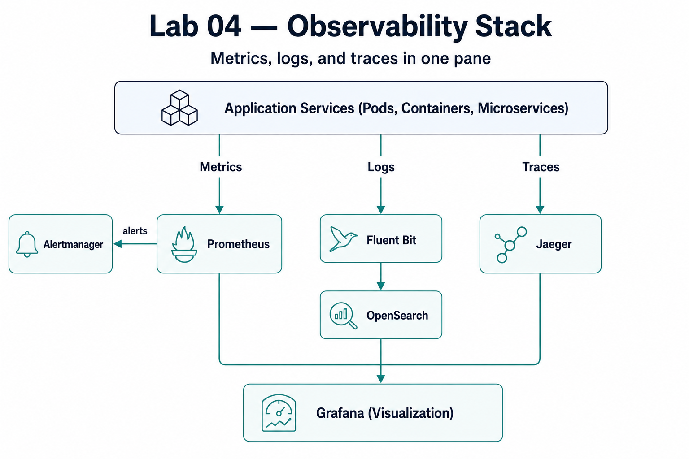

# Lab 04 · Observability Stack

> [DevOps Studio](../../README.md) › [Labs](../README.md) › Lab 04 · ⏱ 2–3 hours · **Advanced**

**See what your systems are actually doing — metrics, logs, and traces in one place. By the end you'll have Prometheus, Grafana, Jaeger, and OpenSearch wired together with dashboards and alerts.**

**On this page:** [Architecture](#architecture) · [Prerequisites](#prerequisites) · [Quick Start](#quick-start) · [Detailed Setup](#detailed-setup) · [Project Structure](#project-structure) · [Components](#components) · [Troubleshooting](#troubleshooting) · [Cleanup](#cleanup)

## What you build

- **Prometheus** — metrics collection
- **Grafana** — dashboards
- **Jaeger** — distributed traces
- **OpenSearch + Fluent Bit** — log aggregation
- **Alertmanager** — alerting on the metrics

**Skills you'll practice:** the three pillars (metrics, logs, traces) · Prometheus queries · Grafana dashboards · distributed tracing · log aggregation · alerting.

## Architecture




### Data Flow

1. **Metrics**: Applications → Prometheus → Grafana
2. **Logs**: Applications → Fluent Bit → OpenSearch → Grafana
3. **Traces**: Applications → Jaeger → Grafana

---

## Prerequisites

### Required Tools

| Tool | Version | Purpose |
|------|---------|---------|
| **kubectl** | 1.32+ | Kubernetes cluster management |
| **Helm** | 3.10+ | Package management |
| **curl** | Latest | API testing |

### AWS Requirements

- **EKS Cluster** from Lab 02 (or existing Kubernetes cluster)
- **kubectl** configured to access the cluster

### Knowledge Prerequisites

- Basic Kubernetes concepts
- Understanding of Lab 02 (Kubernetes Platform)
- Basic understanding of monitoring concepts

### Lab Dependencies

**Required**: Complete [Lab 02](../02-kubernetes-platform/) first to have an EKS cluster.

---

## Quick Start

For experienced users who want to deploy immediately:

```bash
# 1. Navigate to lab directory
cd labs/04-observability-stack

# 2. Install complete stack
make install-all

# 3. Access dashboards (in separate terminals)
kubectl port-forward -n observability svc/grafana 3000:80
kubectl port-forward -n observability svc/prometheus-kube-prometheus-prometheus 9090:9090
kubectl port-forward -n observability svc/jaeger-query 16686:16686
kubectl port-forward -n observability svc/opensearch-dashboards 5601:5601

# 4. Open in browser
# Grafana: http://localhost:3000 (admin/admin)
# Prometheus: http://localhost:9090
# Jaeger: http://localhost:16686
# OpenSearch: http://localhost:5601 (admin/admin)
```

**Setup time**: ~10-15 minutes  
**Estimated cost**: $2-5 to complete (vs $40-60/month if kept running)

---

## Detailed Setup

### Step 1: Verify Cluster Access

```bash
# Check kubectl is configured
kubectl cluster-info
kubectl get nodes
```

### Step 2: Install Components

You can install components individually or all at once:

```bash
# Install all at once (recommended)
make install-all

# Or install individually
make install-prometheus
make install-grafana
make install-jaeger
make install-opensearch
```

### Step 3: Verify Installation

```bash
# Check status
make status

# Or manually
kubectl get pods -n observability
```

---

## Project Structure

```
labs/04-observability-stack/
├── README.md                    # This file
├── Makefile                     # Automation commands
├── prometheus/                  # Prometheus configurations
│   └── (Helm chart)
├── grafana/                     # Grafana configurations
│   └── (Helm chart)
├── jaeger/                      # Jaeger configurations
│   └── (Helm chart)
├── opensearch/                  # OpenSearch configurations
│   ├── README.md               # OpenSearch guide
│   ├── manifests/              # Kubernetes manifests
│   │   ├── opensearch-cluster.yaml
│   │   ├── opensearch-dashboards.yaml
│   │   └── fluent-bit-config.yaml
│   └── config/                 # Configuration files
└── scripts/                     # Automation scripts
```

---

## Components

### Prometheus (Metrics)

**What it does**: Collects and stores metrics as time-series data.

**Key Features**:
- Scrapes metrics from services
- Stores time-series data
- PromQL query language
- Alerting rules

**Access**: `kubectl port-forward -n observability svc/prometheus-kube-prometheus-prometheus 9090:9090`

### Grafana (Visualization)

**What it does**: Creates dashboards and visualizations from metrics, logs, and traces.

**Key Features**:
- Connect to Prometheus, OpenSearch, Jaeger
- Pre-built dashboards
- Custom dashboard creation
- Alerting

**Access**: `kubectl port-forward -n observability svc/grafana 3000:80`  
**Credentials**: admin / admin

### Jaeger (Distributed Tracing)

**What it does**: Traces requests across multiple services in microservices architectures.

**Key Features**:
- Request flow visualization
- Service dependency mapping
- Performance bottleneck identification
- Trace search and analysis

**Access**: `kubectl port-forward -n observability svc/jaeger-query 16686:16686`

### OpenSearch (Log Aggregation)

**What it does**: Stores, searches, and analyzes application logs.

**Key Features**:
- Centralized log storage
- Full-text search
- Real-time log analysis
- OpenSearch Dashboards UI

**Access**: `kubectl port-forward -n observability svc/opensearch-dashboards 5601:5601`  
**Credentials**: admin / admin

See [opensearch/README.md](opensearch/README.md) for detailed OpenSearch documentation.

---

## Integration

### Grafana Data Sources

Grafana can connect to all components:

1. **Prometheus**: Metrics visualization
2. **OpenSearch**: Log queries and dashboards
3. **Jaeger**: Trace visualization

### Complete Observability

With all components, you can:
- **Monitor** system health (Prometheus + Grafana)
- **Search** application logs (OpenSearch)
- **Trace** request flows (Jaeger)
- **Visualize** everything (Grafana)

---

## Usage Examples

### Query Metrics in Prometheus

```promql
# CPU usage
rate(container_cpu_usage_seconds_total[5m])

# Memory usage
container_memory_usage_bytes

# Request rate
rate(http_requests_total[5m])
```

### Search Logs in OpenSearch

```bash
# Search for errors
curl -X GET "opensearch:9200/kubernetes-logs/_search?q=level:ERROR" \
  -u admin:admin

# Get logs by service
curl -X GET "opensearch:9200/kubernetes-logs/_search" \
  -u admin:admin \
  -H 'Content-Type: application/json' \
  -d '{
    "query": {
      "match": {
        "kubernetes.labels.app": "sample-app"
      }
    }
  }'
```

### View Traces in Jaeger

1. Open Jaeger UI
2. Select service
3. Click "Find Traces"
4. View trace timeline and spans

---

## Troubleshooting

### Components Not Starting

```bash
# Check pod status
kubectl get pods -n observability

# Check logs
kubectl logs -n observability <pod-name>

# Check events
kubectl describe pod -n observability <pod-name>
```

### High Resource Usage

```bash
# Check resource usage
kubectl top pods -n observability

# Adjust resource limits in manifests
```

### Connection Issues

```bash
# Test service connectivity
kubectl run -it --rm debug --image=curlimages/curl --restart=Never -- \
  curl http://opensearch:9200/_cluster/health
```

---

## Cleanup

### Remove All Components

```bash
# Uninstall everything
make uninstall-all

# Or manually
kubectl delete namespace observability
```

---

## Cost Considerations

### Estimated Costs

**Monthly Cost** (if running continuously): ~$40-60
- Prometheus: $10-15/month
- Grafana: $5-10/month
- Jaeger: $5-10/month
- OpenSearch: $20-30/month (storage)

**Cost to Complete** (run for 2-3 hours): ~$2-5
- Component deployment: Minimal
- Storage: Negligible for short-term
- Compute: Included in cluster costs

### Cost Optimization

- Use smaller node sizes for dev/test
- Set log retention policies
- Archive old logs to S3
- Use managed services (AWS OpenSearch Service) for production

---

## Next Steps

### Immediate Next Actions
1. **Explore dashboards** in Grafana
2. **Search logs** in OpenSearch
3. **View traces** in Jaeger
4. **Create custom dashboards**

### Continue Your Learning Journey

#### Next Recommended Lab
- **[Lab 05 - Security Automation](../05-security-automation/README.md)** - Secure your observability stack

#### Related Labs
- **[Lab 02: Kubernetes Platform](../02-kubernetes-platform/README.md)** - Monitor this cluster
- **[Lab 03: CI/CD Pipelines](../03-cicd-pipelines/README.md)** - Monitor deployments

---

## Additional Resources

### Documentation
- [Prometheus Docs](https://prometheus.io/docs/)
- [Grafana Docs](https://grafana.com/docs/)
- [Jaeger Docs](https://www.jaegertracing.io/docs/)
- [OpenSearch Docs](https://opensearch.org/docs/)

### Learning Resources
- [Observability Tools Explained](../../docs/observability-tools-explained.md) - Understanding metrics, logs, and traces
- [Prometheus Best Practices](https://prometheus.io/docs/practices/)
- [Grafana Dashboard Examples](https://grafana.com/grafana/dashboards/)

---

**🎉 Congratulations!** You've deployed a complete observability stack covering metrics, logs, and traces. You now have full visibility into your applications and infrastructure!

**Ready for the next challenge?** Continue to [Lab 05 - Security Automation](../05-security-automation/) to secure your platform!

---

**Navigation:** [◀ Lab 03 · CI/CD Pipelines](../03-cicd-pipelines/README.md) · [All labs](../README.md) · [Lab 05 · Security Automation ▶](../05-security-automation/README.md)
