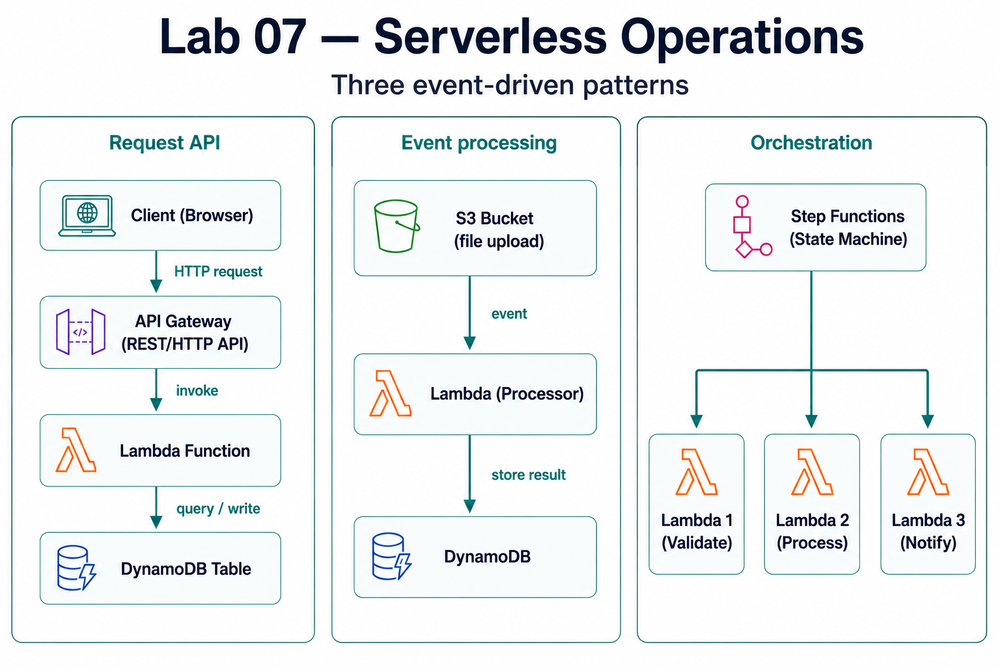

# Lab 07 · Serverless Operations

> [DevOps Studio](../../README.md) › [Labs](../README.md) › Lab 07 · ⏱ 1–2 hours · **Intermediate**

**Build event-driven apps with no servers to manage. By the end you'll have a REST API, an event processor, and a Step Functions workflow running on Lambda, API Gateway, DynamoDB, and EventBridge.**

**On this page:** [Architecture](#architecture) · [Prerequisites](#prerequisites) · [Quick Start](#quick-start) · [Detailed Setup](#detailed-setup) · [Project Structure](#project-structure) · [Core Components](#core-components) · [Troubleshooting](#troubleshooting) · [Cleanup](#cleanup)

## What you build

- **A REST API** — API Gateway → Lambda → DynamoDB
- **Event processing** — S3 / EventBridge → Lambda
- **A Step Functions workflow** orchestrating several Lambdas
- **Monitoring** for serverless functions

**Skills you'll practice:** Lambda functions · API Gateway · DynamoDB · EventBridge · Step Functions · event-driven design · the serverless cost model.

## Architecture




---

## Prerequisites

### Required Tools

| Tool | Version | Purpose |
|------|---------|---------|
| **AWS CLI** | 2.0+ | AWS service management |
| **Python** | 3.9+ | Lambda runtime |
| **Node.js** | 18+ | Lambda runtime |
| **Terraform** | 1.9+ | Infrastructure as Code |
| **Docker** | 20.10+ | Local testing (optional) |

### AWS Requirements

- **AWS Account** with appropriate permissions
- **IAM User/Role** with Lambda, API Gateway, DynamoDB permissions
- **AWS CLI** configured with credentials

### Knowledge Prerequisites

- Basic programming (Python or Node.js)
- Understanding of REST APIs
- Basic AWS knowledge
- Understanding of Lab 01 (Terraform Foundations)

### Lab Dependencies

**Recommended**: Complete [Lab 01](../01-terraform-foundations/) for Terraform basics.

---

## Quick Start

For experienced users who want to deploy immediately:

```bash
# 1. Navigate to lab directory
cd labs/07-serverless-operations

# 2. Configure AWS credentials
aws configure

# 3. Initialize Terraform
make init

# 4. Deploy infrastructure
make deploy

# 5. Test the API
make test-api
```

**Setup time**: ~30-45 minutes  
**Estimated cost**: $1-3 to complete (vs $25-45/month if kept running)

---

## Detailed Setup

### Step 1: Configure AWS Credentials

```bash
# Configure AWS CLI
aws configure

# Enter:
# - AWS Access Key ID
# - AWS Secret Access Key
# - Default region (e.g., us-west-2)
# - Default output format (json)

# Verify configuration
aws sts get-caller-identity
```

### Step 2: Set Up Environment Variables

```bash
# Create terraform.tfvars
cp terraform.tfvars.example terraform.tfvars

# Edit terraform.tfvars with your values
# - project_name
# - aws_region
# - environment
```

### Step 3: Initialize Terraform

```bash
# Initialize Terraform
terraform init

# Or use Makefile
make init
```

### Step 4: Review and Deploy

```bash
# Review what will be created
terraform plan

# Deploy infrastructure
terraform apply

# Or use Makefile
make deploy
```

---

## Project Structure

```
labs/07-serverless-operations/
├── README.md                    # This file
├── Makefile                     # Automation commands
├── main.tf                      # Main Terraform configuration
├── variables.tf                 # Variable definitions
├── outputs.tf                  # Output values
├── terraform.tfvars.example    # Example variables
├── lambda/                      # Lambda functions
│   ├── hello-world/            # Simple Lambda example
│   │   ├── lambda_function.py
│   │   ├── requirements.txt
│   │   └── README.md
│   ├── api-handler/             # API Gateway handler
│   │   ├── lambda_function.py
│   │   └── README.md
│   └── event-processor/        # Event-driven Lambda
│       ├── lambda_function.py
│       └── README.md
├── api-gateway/                 # API Gateway configuration
│   ├── rest-api.tf
│   └── http-api.tf
├── eventbridge/                # EventBridge configuration
│   ├── event-bus.tf
│   └── rules.tf
├── step-functions/              # Step Functions workflows
│   ├── state-machine.tf
│   └── workflows/
├── dynamodb/                    # DynamoDB tables
│   ├── tables.tf
│   └── README.md
├── monitoring/                   # Monitoring setup
│   ├── cloudwatch.tf
│   └── dashboards.tf
└── scripts/                     # Automation scripts
    ├── deploy-lambda.sh
    ├── test-api.sh
    └── validate.sh
```

---

## Core Components

### AWS Lambda

**What it is**: Serverless compute service that runs your code in response to events.

**Key Features**:
- Automatic scaling
- Pay-per-request pricing
- Multiple runtime support
- Integrated with 200+ AWS services

**Use Cases**:
- API backends
- Data processing
- Real-time file processing
- Scheduled tasks
- Event-driven workflows

See [lambda/README.md](lambda/README.md) for detailed examples.

### API Gateway

**What it is**: Fully managed service for creating, publishing, and managing REST and HTTP APIs.

**Key Features**:
- RESTful and HTTP APIs
- Request/response transformation
- Authentication and authorization
- Rate limiting and throttling
- CORS support

**Use Cases**:
- RESTful APIs
- Microservices
- Mobile backends
- Web applications

See [api-gateway/README.md](api-gateway/README.md) for detailed examples.

### EventBridge

**What it is**: Serverless event bus that connects applications using data from your own applications, SaaS applications, and AWS services.

**Key Features**:
- Event routing
- Scheduled rules
- Custom event buses
- Schema registry

**Use Cases**:
- Event-driven architectures
- Microservices communication
- Scheduled tasks
- Application integration

See [eventbridge/README.md](eventbridge/README.md) for detailed examples.

### Step Functions

**What it is**: Serverless workflow service for coordinating multiple AWS services into serverless workflows.

**Key Features**:
- Visual workflow designer
- Error handling
- Parallel and sequential execution
- State management

**Use Cases**:
- Multi-step workflows
- Data processing pipelines
- Approval workflows
- Orchestration

See [step-functions/README.md](step-functions/README.md) for detailed examples.

### DynamoDB

**What it is**: Fully managed NoSQL database service.

**Key Features**:
- Single-digit millisecond latency
- Automatic scaling
- Built-in security
- Global tables

**Use Cases**:
- User sessions
- Shopping carts
- Real-time analytics
- Gaming leaderboards

See [dynamodb/README.md](dynamodb/README.md) for detailed examples.

---

## Step-by-Step Tutorials

### Tutorial 1: Your First Lambda Function

**Objective**: Create and deploy a simple "Hello World" Lambda function.

**Steps**:

1. **Create the function code** (`lambda/hello-world/lambda_function.py`):
```python
import json

def lambda_handler(event, context):
    return {
        'statusCode': 200,
        'body': json.dumps({
            'message': 'Hello from Lambda!',
            'event': event
        })
    }
```

2. **Package the function**:
```bash
cd lambda/hello-world
zip function.zip lambda_function.py
```

3. **Deploy with Terraform** (see `main.tf` for configuration)

4. **Test the function**:
```bash
aws lambda invoke \
  --function-name hello-world \
  --payload '{"key": "value"}' \
  response.json
```

**What you learned**:
- Lambda function structure
- Event and context objects
- Function deployment
- Function invocation

### Tutorial 2: API Gateway + Lambda

**Objective**: Create a REST API that triggers a Lambda function.

**Steps**:

1. **Create Lambda function** (see Tutorial 1)

2. **Create API Gateway**:
   - REST API or HTTP API
   - Create resource and method
   - Integrate with Lambda

3. **Test the API**:
```bash
curl https://your-api-id.execute-api.us-west-2.amazonaws.com/prod/hello
```

**What you learned**:
- API Gateway configuration
- Lambda integration
- Request/response handling
- API testing

### Tutorial 3: Event-Driven Processing

**Objective**: Process S3 file uploads automatically.

**Steps**:

1. **Create S3 bucket** (via Terraform)

2. **Create Lambda function** that processes files

3. **Configure S3 trigger** to invoke Lambda on upload

4. **Test**: Upload a file to S3, Lambda processes it automatically

**What you learned**:
- Event-driven architecture
- S3 integration
- Asynchronous processing

### Tutorial 4: Step Functions Workflow

**Objective**: Create a multi-step workflow.

**Steps**:

1. **Define state machine** (JSON or YAML)

2. **Create Lambda functions** for each step

3. **Deploy Step Functions** state machine

4. **Execute workflow** and monitor progress

**What you learned**:
- Workflow orchestration
- State machine design
- Error handling in workflows

---

## Advanced Patterns

### Pattern 1: Fan-Out

Process one event with multiple Lambda functions:

```
Event → SNS → Multiple Lambdas (parallel)
```

### Pattern 2: Fan-In

Aggregate results from multiple Lambdas:

```
Multiple Lambdas → SQS → Aggregator Lambda
```

### Pattern 3: Circuit Breaker

Handle failures gracefully:

```
Lambda → DynamoDB (with retry logic)
```

### Pattern 4: Event Sourcing

Store events for replay:

```
Events → DynamoDB Streams → Lambda → Event Store
```

---

## Monitoring and Observability

### CloudWatch Logs

Lambda automatically logs to CloudWatch:

```bash
# View logs
aws logs tail /aws/lambda/function-name --follow
```

### CloudWatch Metrics

Monitor function performance:
- Invocations
- Duration
- Errors
- Throttles

### X-Ray Tracing

Enable distributed tracing:

```python
from aws_xray_sdk.core import xray_recorder

@xray_recorder.capture('my_function')
def my_function():
    # Your code
    pass
```

### Dashboards

Create CloudWatch dashboards for visualization.

See [monitoring/README.md](monitoring/README.md) for detailed setup.

---

## Cost Optimization

### Best Practices

1. **Right-Size Memory** - Match memory to workload
2. **Optimize Timeout** - Set appropriate timeouts
3. **Use Provisioned Concurrency** - For consistent performance (if needed)
4. **Reserve Concurrency** - Limit concurrent executions
5. **Monitor Costs** - Use AWS Cost Explorer

### Cost Calculation

**Lambda Pricing**:
- $0.20 per 1M requests
- $0.0000166667 per GB-second

**Example**: 1M requests/month, 128MB, 200ms average:
- Requests: $0.20
- Compute: ~$0.42
- **Total: ~$0.62/month**

---

## Troubleshooting

### Common Issues

**Cold Starts**:
- Use provisioned concurrency for critical functions
- Optimize package size
- Use connection pooling

**Timeout Errors**:
- Increase timeout
- Optimize function code
- Use Step Functions for long-running tasks

**Memory Issues**:
- Increase memory allocation
- Profile function memory usage
- Optimize code

**Permission Errors**:
- Check IAM roles and policies
- Verify resource permissions
- Check VPC configuration (if applicable)

See the [Troubleshooting guide](../../docs/troubleshooting.md) for detailed solutions.

---

## Cleanup

### Remove All Resources

```bash
# Destroy infrastructure
terraform destroy

# Or use Makefile
make destroy
```

**Important**: Always destroy resources when not in use to avoid costs!

---

## Cost Considerations

### Estimated Costs

**Monthly Cost** (if running continuously): ~$25-45
- Lambda: $5-15/month (depending on usage)
- API Gateway: $3.50 per million requests
- DynamoDB: $5-20/month (depending on usage)
- Step Functions: $25 per million state transitions
- CloudWatch: $5-10/month

**Cost to Complete** (run for 1-2 hours): ~$1-3
- Lambda invocations: Minimal
- API Gateway requests: Minimal
- DynamoDB: Pay-per-use
- Monitoring: Included

### Cost Optimization

- Use Lambda for short-running tasks
- Right-size memory allocation
- Use DynamoDB on-demand pricing for variable workloads
- Monitor and optimize with CloudWatch
- Destroy resources when not in use

---

## Next Steps

### Immediate Next Actions
1. **Deploy your first Lambda** function
2. **Create an API** with API Gateway
3. **Set up event-driven** processing
4. **Monitor** with CloudWatch

### Continue Your Learning Journey

#### Next Recommended Lab
- **[Lab 08 - Platform Engineering](../08-platform-engineering/README.md)** - Build internal developer platforms

#### Related Labs
- **[Lab 01: Terraform Foundations](../01-terraform-foundations/README.md)** - Infrastructure as Code
- **[Lab 03: CI/CD Pipelines](../03-cicd-pipelines/README.md)** - Deploy serverless with CI/CD
- **[Lab 04: Observability Stack](../04-observability-stack/README.md)** - Monitor serverless applications

---

## Additional Resources

### Documentation
- [AWS Lambda Documentation](https://docs.aws.amazon.com/lambda/)
- [API Gateway Documentation](https://docs.aws.amazon.com/apigateway/)
- [Step Functions Documentation](https://docs.aws.amazon.com/step-functions/)
- [DynamoDB Documentation](https://docs.aws.amazon.com/dynamodb/)

### Learning Resources
- [AWS Serverless Application Model (SAM)](https://aws.amazon.com/serverless/sam/)
- [Serverless Framework](https://www.serverless.com/)
- [AWS Well-Architected Framework - Serverless](https://aws.amazon.com/architecture/well-architected/)

---

**🎉 Congratulations!** You've mastered serverless architecture with AWS Lambda, API Gateway, EventBridge, Step Functions, and DynamoDB. You can now build scalable, cost-effective, event-driven applications!

**Ready for the final challenge?** Continue to [Lab 08 - Platform Engineering](../08-platform-engineering/) to build internal developer platforms!

---

**Navigation:** [◀ Lab 06 · GitOps Workflows](../06-gitops-workflows/README.md) · [All labs](../README.md) · [Lab 08 · Platform Engineering ▶](../08-platform-engineering/README.md)
