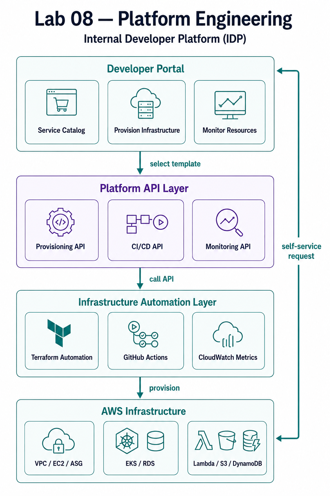

# Lab 08 · Platform Engineering

> [DevOps Studio](../../README.md) › [Labs](../README.md) › Lab 08 · ⏱ 3–4 hours · **Expert**

**Build an internal developer platform that lets engineers self-serve infrastructure. By the end you'll have a service catalog, a platform API, and automation that provisions real AWS resources from a template.**

**On this page:** [Architecture](#architecture) · [Prerequisites](#prerequisites) · [Quick Start](#quick-start) · [Detailed Setup](#detailed-setup) · [Project Structure](#project-structure) · [Core Components](#core-components) · [Troubleshooting](#troubleshooting) · [Cleanup](#cleanup)

## What you build

- **A service catalog** of golden-path templates
- **A platform API** — provisioning, CI/CD, and monitoring endpoints
- **Terraform-based provisioning automation**
- **A self-service developer portal**
- **Platform monitoring**

**Skills you'll practice:** internal developer platforms · service catalogs · platform APIs · self-service provisioning · golden paths · Terraform automation.

## Architecture




---

## Prerequisites

### Required Tools

| Tool | Version | Purpose |
|------|---------|---------|
| **AWS CLI** | 2.0+ | AWS service management |
| **Terraform** | 1.9+ | Infrastructure as Code |
| **Docker** | 20.10+ | Container runtime |
| **kubectl** | 1.32+ | Kubernetes management |
| **Node.js** | 18+ | Portal development |
| **Python** | 3.9+ | Automation scripts |

### AWS Requirements

- **AWS Account** with appropriate permissions
- **EKS Cluster** from Lab 02 (or existing cluster)
- **IAM User/Role** with platform permissions

### Knowledge Prerequisites

- Understanding of Labs 01-07
- Basic Kubernetes knowledge
- Terraform experience
- API design concepts

### Lab Dependencies

**Recommended**: Complete previous labs, especially:
- [Lab 01: Terraform Foundations](../01-terraform-foundations/)
- [Lab 02: Kubernetes Platform](../02-kubernetes-platform/)
- [Lab 06: GitOps Workflows](../06-gitops-workflows/)

---

## Quick Start

### Option 1: Deploy Platform Infrastructure (Foundation)

This sets up the platform foundation (S3, DynamoDB, IAM roles):

```bash
# 1. Navigate to lab directory
cd labs/08-platform-engineering

# 2. Configure environment
cp terraform.tfvars.example terraform.tfvars
# Edit terraform.tfvars with your values

# 3. Initialize and deploy
make init
make deploy

# 4. Verify deployment
make validate
```

**Setup time**: ~10-15 minutes  
**Estimated cost**: $1-2/month (minimal resources)

### Option 2: Use Service Catalog Templates (Immediate Value)

Skip platform setup and use the templates directly:

```bash
# Deploy a web application
cd service-catalog/web-app
terraform init
terraform apply

# Deploy an API service
cd ../api-service
terraform init
terraform apply
```

**Setup time**: ~15-20 minutes per template  
**Estimated cost**: Varies by template (see template READMEs)

### Option 3: Use Automation Tools (Programmatic)

Use the Python scripts for automation:

```bash
# Install dependencies
pip install -r automation/terraform-runner/requirements.txt

# Run Terraform automation
python automation/terraform-runner/terraform_runner.py plan \
  --workspace my-app \
  --template service-catalog/web-app \
  --state-bucket YOUR_BUCKET \
  --state-table YOUR_TABLE

# Generate CI/CD pipeline
python automation/ci-cd-generator/generate_pipeline.py \
  --service my-app \
  --repository github.com/org/repo \
  --template standard-web-app
```

**Setup time**: ~5 minutes  
**Estimated cost**: No additional cost (uses existing infrastructure)

---

## Detailed Setup

### Step 1: Configure AWS Credentials

```bash
# Configure AWS CLI
aws configure

# Verify access
aws sts get-caller-identity
```

### Step 2: Set Up Environment Variables

```bash
# Create terraform.tfvars
cp terraform.tfvars.example terraform.tfvars

# Edit with your values
# - project_name
# - aws_region
# - eks_cluster_name (from Lab 02)
```

### Step 3: Initialize Terraform

```bash
terraform init
```

### Step 4: Review and Deploy

```bash
# Review plan
terraform plan

# Deploy platform
terraform apply
```

---

## Project Structure

```
labs/08-platform-engineering/
├── README.md                    # This file - Start here!
├── PLATFORM-ARCHITECTURE.md     # Detailed architecture explanation
├── Makefile                     # Automation commands
├── main.tf                      # Main Terraform configuration
├── variables.tf                 # Variable definitions
├── outputs.tf                   # Output values
├── terraform.tfvars.example     # Example configuration
│
├── service-catalog/             # Service Catalog - Ready-to-use templates
│   ├── README.md               # How to use the service catalog
│   ├── web-app/                # Web Application Template
│   │   ├── README.md           # Template documentation
│   │   └── main.tf             # WORKING Terraform template
│   ├── api-service/            # API Service Template
│   │   ├── README.md           # Template documentation
│   │   └── main.tf             # WORKING Terraform template
│   └── data-pipeline/          # Data Pipeline Template
│       ├── README.md           # Template documentation
│       └── main.tf             # WORKING Terraform template
│
├── platform-api/                # Platform APIs - Lambda functions
│   ├── README.md               # API documentation
│   ├── provisioning/           # Provisioning API
│   │   ├── README.md           # API endpoint docs
│   │   └── lambda_function.py  # WORKING Lambda function
│   └── monitoring/             # Monitoring API
│       ├── README.md           # API endpoint docs
│       └── lambda_function.py  # WORKING Lambda function
│
├── automation/                  # Automation Tools - Working scripts
│   ├── README.md               # Automation overview
│   ├── terraform-runner/       # Terraform execution automation
│   │   ├── README.md           # How to use the runner
│   │   ├── terraform_runner.py # WORKING Python script
│   │   └── requirements.txt    # Python dependencies
│   └── ci-cd-generator/        # CI/CD pipeline generator
│       ├── README.md           # How to use the generator
│       └── generate_pipeline.py # WORKING Python script
│
├── monitoring/                  # Platform Monitoring - Dashboards & Metrics
│   ├── README.md               # Monitoring overview
│   ├── dashboards/             # CloudWatch dashboards
│   │   ├── README.md           # Dashboard documentation
│   │   ├── platform-health.json # WORKING dashboard config
│   │   └── cost-tracking.json  # WORKING dashboard config
│   └── metrics/                # Custom metrics
│       ├── README.md           # Metrics documentation
│       └── publish_metrics.py  # WORKING metrics script
│
├── portal/                      # Developer Portal (Optional)
│   ├── README.md               # Portal setup guide
│   └── config/                 # Portal configuration
│       └── app-config.yaml     # Example portal config
│
├── backstage/                   # Backstage Portal (Optional)
│   └── README.md               # Backstage setup guide
│
└── scripts/                     # Utility Scripts
    └── validate.sh             # WORKING validation script
```

**Legend**:
- = Working implementation (actual code you can run)
- 📄 = Documentation only

---

## What's Included (Working Implementations)

This lab includes **actual working code** you can use immediately:

### Service Catalog Templates (3 Ready-to-Use Templates)

**Location**: `service-catalog/`

1. **Web Application** (`web-app/main.tf`)
   - Complete Terraform template
   - Provisions: ALB, Auto Scaling Group, RDS database
   - Ready to deploy with `terraform apply`
   - See [web-app/README.md](service-catalog/web-app/README.md) for usage

2. **API Service** (`api-service/main.tf`)
   - Complete Terraform template
   - Provisions: API Gateway, Lambda functions, DynamoDB
   - Serverless API ready to use
   - See [api-service/README.md](service-catalog/api-service/README.md) for usage

3. **Data Pipeline** (`data-pipeline/main.tf`)
   - Complete Terraform template
   - Provisions: AWS Glue jobs, S3 buckets, EventBridge schedules
   - ETL pipeline ready to configure
   - See [data-pipeline/README.md](service-catalog/data-pipeline/README.md) for usage

**How to Use**:
```bash
# Example: Deploy web application template
cd service-catalog/web-app
terraform init
terraform plan
terraform apply
```

### Platform APIs (2 Working Lambda Functions)

**Location**: `platform-api/`

1. **Provisioning API** (`provisioning/lambda_function.py`)
   - Lambda function for infrastructure provisioning
   - Handles POST `/api/v1/provision` requests
   - Returns provisioning status
   - Ready to deploy to AWS Lambda
   - See [provisioning/README.md](platform-api/provisioning/README.md) for API docs

2. **Monitoring API** (`monitoring/lambda_function.py`)
   - Lambda function for metrics and monitoring
   - Handles GET `/api/v1/metrics` requests
   - Queries CloudWatch metrics
   - Ready to deploy to AWS Lambda
   - See [monitoring/README.md](platform-api/monitoring/README.md) for API docs

**How to Use**:
```bash
# Deploy Lambda functions (via Terraform or manually)
# Then call via API Gateway or directly
aws lambda invoke --function-name provisioning-api --payload '{"template":"web-app"}'
```

### Automation Tools (2 Working Python Scripts)

**Location**: `automation/`

1. **Terraform Runner** (`terraform-runner/terraform_runner.py`)
   - Python script that executes Terraform in isolated workspaces
   - Manages state in S3 with DynamoDB locking
   - Supports: plan, apply, destroy operations
   - **Ready to run**: `python terraform_runner.py plan --workspace my-app --template ../service-catalog/web-app`
   - See [terraform-runner/README.md](automation/terraform-runner/README.md) for usage

2. **CI/CD Generator** (`ci-cd-generator/generate_pipeline.py`)
   - Python script that generates GitHub Actions workflows
   - Creates deploy pipelines for multiple environments
   - **Ready to run**: `python generate_pipeline.py --service my-app --repository github.com/org/repo --template standard-web-app`
   - See [ci-cd-generator/README.md](automation/ci-cd-generator/README.md) for usage

**How to Use**:
```bash
# Install dependencies
pip install -r automation/terraform-runner/requirements.txt

# Run Terraform runner
python automation/terraform-runner/terraform_runner.py plan \
  --workspace my-app-dev \
  --template service-catalog/web-app \
  --state-bucket my-state-bucket \
  --state-table my-state-table

# Generate CI/CD pipeline
python automation/ci-cd-generator/generate_pipeline.py \
  --service my-app \
  --repository github.com/myorg/my-app \
  --template standard-web-app
```

### Monitoring Tools (Dashboards & Metrics Scripts)

**Location**: `monitoring/`

1. **CloudWatch Dashboards** (`dashboards/`)
   - `platform-health.json` - Platform health metrics dashboard
   - `cost-tracking.json` - Cost monitoring dashboard
   - **Ready to import**: `aws cloudwatch put-dashboard --dashboard-name platform-health --dashboard-body file://dashboards/platform-health.json`
   - See [dashboards/README.md](monitoring/dashboards/README.md) for usage

2. **Metrics Publisher** (`metrics/publish_metrics.py`)
   - Python script to publish custom metrics to CloudWatch
   - Supports: provisioning, API, and resource metrics
   - **Ready to run**: `python publish_metrics.py provisioning true 120`
   - See [metrics/README.md](monitoring/metrics/README.md) for usage

**How to Use**:
```bash
# Import dashboards
aws cloudwatch put-dashboard \
  --dashboard-name platform-health \
  --dashboard-body file://monitoring/dashboards/platform-health.json

# Publish metrics
python monitoring/metrics/publish_metrics.py provisioning true 120
```

### 📄 Documentation & Configuration

- **Portal Configuration** (`portal/config/app-config.yaml`) - Example portal config
- **Backstage Setup** (`backstage/README.md`) - Optional Backstage portal guide
- **Architecture Docs** (`PLATFORM-ARCHITECTURE.md`) - Detailed architecture explanation

---

## Core Components Explained

### Service Catalog

**What it is**: Pre-built Terraform templates for common infrastructure patterns.

**What you get**:
- 3 complete Terraform templates (web-app, api-service, data-pipeline)
- Each template is production-ready with security, monitoring, and best practices
- Documentation for each template
- Parameter examples

**How to use**: Navigate to a template directory, configure variables, run `terraform apply`.

### Platform APIs

**What it is**: Lambda functions that provide REST API endpoints for platform operations.

**What you get**:
- Provisioning API Lambda function (provision infrastructure via API)
- Monitoring API Lambda function (query metrics via API)
- API documentation with request/response examples

**How to use**: Deploy Lambda functions, set up API Gateway, call endpoints via HTTP.

### Automation Tools

**What it is**: Python scripts that automate common platform operations.

**What you get**:
- Terraform Runner: Automates Terraform execution with workspace isolation
- CI/CD Generator: Creates GitHub Actions workflows automatically

**How to use**: Run Python scripts with appropriate parameters.

### Monitoring

**What it is**: CloudWatch dashboards and metrics publishing tools.

**What you get**:
- 2 CloudWatch dashboard configurations (health, cost)
- Python script to publish custom metrics

**How to use**: Import dashboards to CloudWatch, run metrics script to publish data.

---

## Step-by-Step Tutorials

### Tutorial 1: Deploy Your First Service Template

**Objective**: Use the web application template to provision infrastructure.

**What you'll do**: Deploy a complete web application stack (ALB, ASG, RDS) using the provided Terraform template.

**Steps**:

1. **Navigate to Template**
   ```bash
   cd labs/08-platform-engineering/service-catalog/web-app
   ```

2. **Review the Template**
   ```bash
   # Look at what will be created
   cat main.tf
   cat README.md
   ```

3. **Configure Variables**
   ```bash
   # Create terraform.tfvars
   cat > terraform.tfvars <<EOF
   app_name = "my-first-app"
   environment = "dev"
   instance_type = "t3.medium"
   min_size = 2
   max_size = 5
   EOF
   ```

4. **Initialize and Deploy**
   ```bash
   # Initialize Terraform
   terraform init
   
   # Review what will be created
   terraform plan
   
   # Deploy (when ready)
   terraform apply
   ```

5. **Access Your Application**
   ```bash
   # Get the ALB DNS name
   terraform output alb_dns_name
   
   # Visit in browser or curl
   curl http://$(terraform output -raw alb_dns_name)
   ```

**What you learned**:
- How to use service catalog templates
- Terraform variable configuration
- Infrastructure provisioning

**Cleanup**:
```bash
terraform destroy
```

---

### Tutorial 2: Use the Terraform Runner

**Objective**: Use the automation script to provision infrastructure programmatically.

**What you'll do**: Use the Python Terraform Runner script to execute Terraform in an isolated workspace.

**Steps**:

1. **Set Up Prerequisites**
   ```bash
   # Install Python dependencies
   pip install -r automation/terraform-runner/requirements.txt
   
   # Get platform state bucket and table (from main.tf outputs)
   cd labs/08-platform-engineering
   terraform output platform_state_bucket
   terraform output platform_state_lock_table
   ```

2. **Run Terraform Plan**
   ```bash
   python automation/terraform-runner/terraform_runner.py plan \
     --workspace my-app-dev \
     --template service-catalog/web-app \
     --state-bucket $(terraform output -raw platform_state_bucket) \
     --state-table $(terraform output -raw platform_state_lock_table) \
     --variables '{"app_name":"my-app","environment":"dev"}'
   ```

3. **Apply the Plan**
   ```bash
   python automation/terraform-runner/terraform_runner.py apply \
     --workspace my-app-dev \
     --template service-catalog/web-app \
     --state-bucket $(terraform output -raw platform_state_bucket) \
     --state-table $(terraform output -raw platform_state_lock_table)
   ```

**What you learned**:
- Automated Terraform execution
- Workspace isolation
- State management

---

### Tutorial 3: Generate a CI/CD Pipeline

**Objective**: Automatically create a GitHub Actions workflow for your service.

**What you'll do**: Use the CI/CD generator script to create a deployment pipeline.

**Steps**:

1. **Generate Pipeline**
   ```bash
   python automation/ci-cd-generator/generate_pipeline.py \
     --service my-web-app \
     --repository github.com/myorg/my-web-app \
     --template standard-web-app \
     --environments dev staging prod \
     --output .github/workflows/deploy.yml
   ```

2. **Review Generated Pipeline**
   ```bash
   cat .github/workflows/deploy.yml
   ```

3. **Commit to Repository**
   ```bash
   git add .github/workflows/deploy.yml
   git commit -m "Add CI/CD pipeline"
   git push
   ```

**What you learned**:
- Automated pipeline generation
- Multi-environment deployments
- GitHub Actions workflow creation

---

### Tutorial 4: Set Up Monitoring Dashboards

**Objective**: Import CloudWatch dashboards to monitor your platform.

**What you'll do**: Import the provided dashboard configurations into CloudWatch.

**Steps**:

1. **Import Platform Health Dashboard**
   ```bash
   aws cloudwatch put-dashboard \
     --dashboard-name platform-health \
     --dashboard-body file://monitoring/dashboards/platform-health.json
   ```

2. **Import Cost Tracking Dashboard**
   ```bash
   aws cloudwatch put-dashboard \
     --dashboard-name platform-cost \
     --dashboard-body file://monitoring/dashboards/cost-tracking.json
   ```

3. **View Dashboards**
   ```bash
   # Open AWS Console and navigate to CloudWatch > Dashboards
   # Or get dashboard URL
   aws cloudwatch get-dashboard --dashboard-name platform-health
   ```

4. **Publish Custom Metrics**
   ```bash
   # Publish a provisioning success metric
   python monitoring/metrics/publish_metrics.py provisioning true 120
   
   # Publish API metrics
   python monitoring/metrics/publish_metrics.py api 1000 5 250
   ```

**What you learned**:
- CloudWatch dashboard setup
- Custom metrics publishing
- Platform observability

---

## Advanced Patterns

### Pattern 1: Multi-Tenancy

Support multiple teams with:
- Namespace isolation
- Resource quotas
- Team-specific catalogs

### Pattern 2: Approval Workflows

Add approvals for:
- Production deployments
- High-cost resources
- Security-sensitive changes

### Pattern 3: Custom Templates

Create team-specific templates:
- Domain-specific services
- Custom configurations
- Team best practices

### Pattern 4: Cost Optimization

Automated cost optimization:
- Right-sizing recommendations
- Unused resource cleanup
- Reserved instance management

---

## Monitoring and Metrics

### Platform Metrics

Monitor:
- **Provisioning Rate** - Services created per day
- **Success Rate** - Successful vs failed provisions
- **Time to Provision** - Average provisioning time
- **Resource Utilization** - CPU, memory, storage
- **Cost per Service** - Cost tracking

### Developer Metrics

Track:
- **Active Developers** - Platform usage
- **Services per Developer** - Productivity
- **Time to First Deploy** - Developer experience
- **Support Tickets** - Platform issues

### Cost Metrics

Monitor:
- **Total Platform Cost** - Overall spending
- **Cost per Service** - Service-level costs
- **Cost Trends** - Spending patterns
- **Budget Alerts** - Cost thresholds

See [monitoring/README.md](monitoring/README.md) for detailed setup.

---

## Troubleshooting

### Common Issues

**Portal Not Accessible**:
- Check ingress configuration
- Verify DNS settings
- Check security groups

**Provisioning Fails**:
- Check Terraform logs
- Verify IAM permissions
- Review resource limits

**CI/CD Pipeline Issues**:
- Check GitHub Actions logs
- Verify repository access
- Review pipeline configuration

See the [Troubleshooting guide](../../docs/troubleshooting.md) for detailed solutions.

---

## Cleanup

### Remove All Resources

```bash
# Destroy platform
terraform destroy

# Or use Makefile
make destroy
```

**Important**: Always destroy resources when not in use to avoid costs!

---

## Cost Considerations

### Estimated Costs

**Monthly Cost** (if running continuously): ~$80-120
- Portal infrastructure: $30-50/month
- Platform APIs: $20-30/month
- Monitoring: $10-20/month
- Automation: $20-30/month

**Cost to Complete** (run for 3-4 hours): ~$5-10
- Portal deployment: Minimal
- API usage: Pay-per-request
- Monitoring: Included
- Infrastructure: Pay-per-use

### Cost Optimization

- Use spot instances for non-critical components
- Right-size portal infrastructure
- Monitor and optimize API usage
- Destroy test resources immediately

---

## Next Steps

### Immediate Next Actions
1. **Deploy the platform** and verify all components
2. **Create your first service** from the catalog
3. **Set up monitoring** and dashboards
4. **Document your platform** for your team

### Continue Your Learning Journey

#### You've Completed All Labs! 🎉
- **Lab 01**: Terraform Foundations
- **Lab 02**: Kubernetes Platform
- **Lab 03**: CI/CD Pipelines
- **Lab 04**: Observability Stack
- **Lab 05**: Security Automation
- **Lab 06**: GitOps Workflows
- **Lab 07**: Serverless Operations
- **Lab 08**: Platform Engineering

### Real-World Applications

Apply what you've learned to:
- Build internal developer platforms
- Enable self-service infrastructure
- Improve developer productivity
- Implement platform engineering practices

---

## Additional Resources

### Documentation
- [Platform Engineering Guide](https://platformengineering.org/)
- [Backstage Documentation](https://backstage.io/docs)
- [Internal Developer Platforms](https://internaldeveloperplatform.org/)

### Learning Resources
- [Platform Engineering Best Practices](https://platformengineering.org/blog)
- [Building IDPs](https://www.thoughtworks.com/insights/blog/platform-engineering)

---

**🎉 Congratulations!** You've completed all 8 labs and mastered the complete DevOps and Platform Engineering journey! You now have the skills to build production-ready platforms that enable self-service infrastructure, improve developer experience, and maintain governance and best practices.

**You're ready to build amazing platforms!** 🚀

---

**Navigation:** [◀ Lab 07 · Serverless Operations](../07-serverless-operations/README.md) · [All labs](../README.md)
