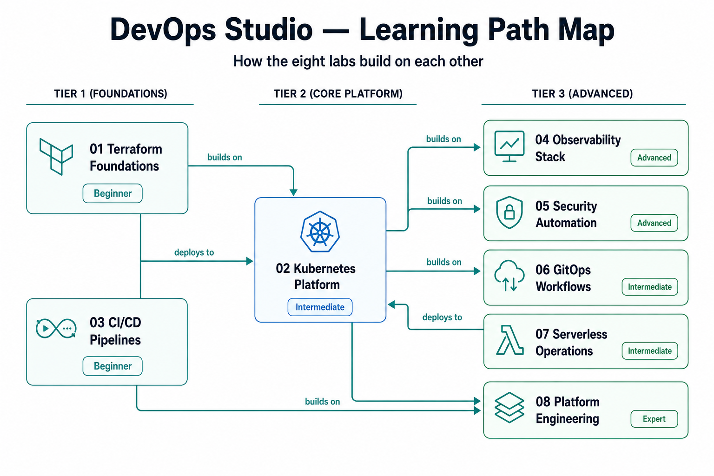

# Labs

Eight self-contained, production-grade labs. Each includes working code, a detailed walkthrough, validation steps, cost notes, and cleanup automation.

> [DevOps Studio](../README.md) › Labs
>
> New here? Read the [Prerequisites](../docs/prerequisites.md) and [Getting Started](../docs/getting-started.md) guides first, then pick a [Learning Path](../docs/learning-paths.md).

## Foundation labs (start here)

| Lab | Focus | Technologies | Time | Difficulty |
|-----|-------|--------------|------|------------|
| [01 · Terraform Foundations](01-terraform-foundations/) | Infrastructure as Code | Terraform, AWS VPC, ASG, RDS | 1–2 h | Beginner |
| [02 · Kubernetes Platform](02-kubernetes-platform/) | Container orchestration | EKS, Helm, kubectl, Ingress | 2–3 h | Intermediate |
| [03 · CI/CD Pipelines](03-cicd-pipelines/) | Automation & delivery | GitHub Actions, GitLab CI, Jenkins | 1–2 h | Beginner |

## Advanced labs

| Lab | Focus | Technologies | Time | Difficulty |
|-----|-------|--------------|------|------------|
| [04 · Observability Stack](04-observability-stack/) | Monitoring & alerting | Prometheus, Grafana, Jaeger, OpenSearch | 2–3 h | Advanced |
| [05 · Security Automation](05-security-automation/) | DevSecOps | Trivy, OPA, Falco, RBAC | 1–2 h | Advanced |
| [06 · GitOps Workflows](06-gitops-workflows/) | GitOps & CD | Kustomize, Argo CD, Flux | 1–2 h | Intermediate |
| [07 · Serverless Operations](07-serverless-operations/) | Serverless ops | Lambda, API Gateway, Step Functions, DynamoDB | 1–2 h | Intermediate |
| [08 · Platform Engineering](08-platform-engineering/) | Internal platforms | Service catalog, platform APIs, automation | 3–4 h | Expert |

## Suggested order

For the complete curriculum, work the labs in order: **01 → 02 → 03 → 04 → 05 → 06 → 07 → 08**. To target a specific role instead, follow a [Learning Path](../docs/learning-paths.md).
